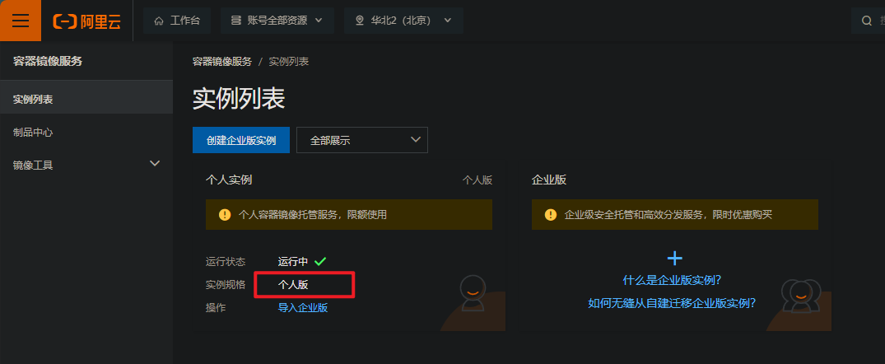
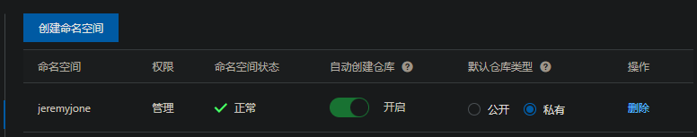
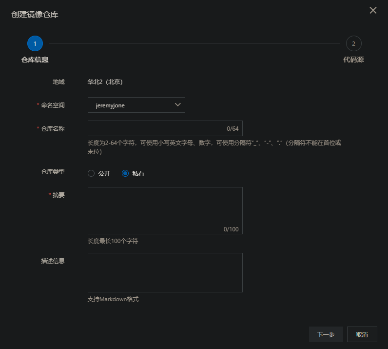
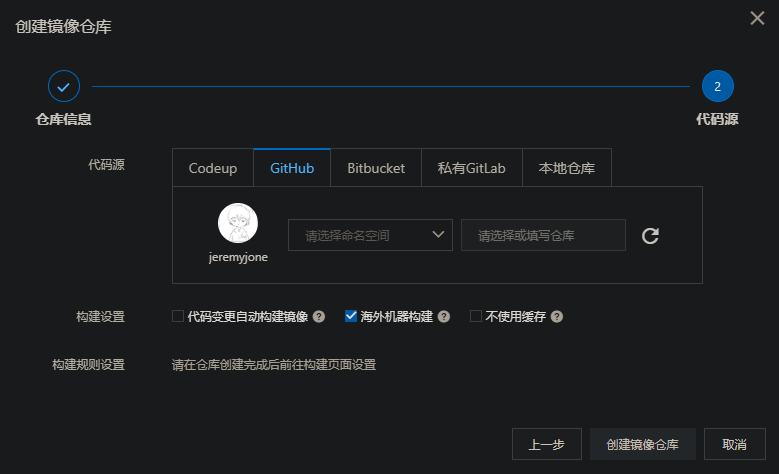
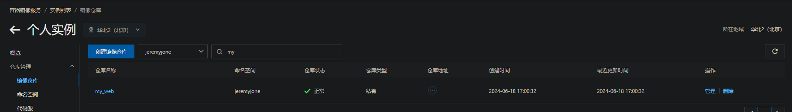
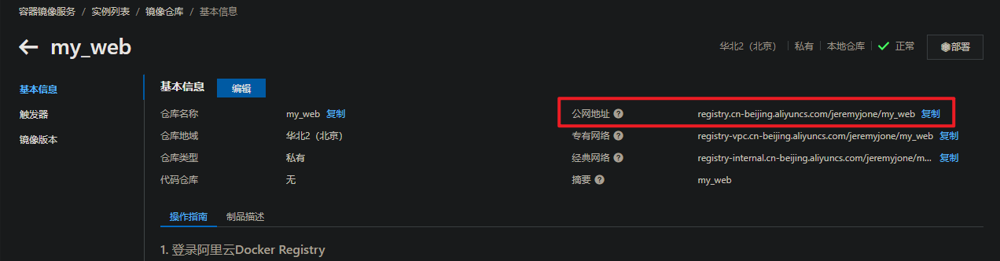
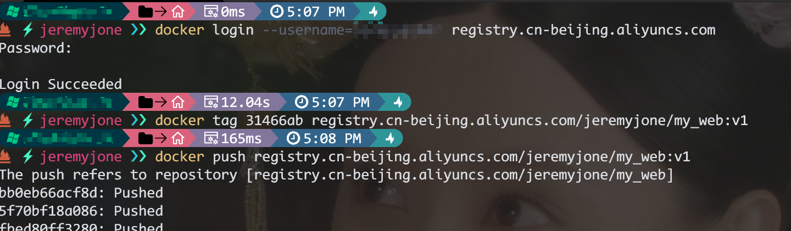
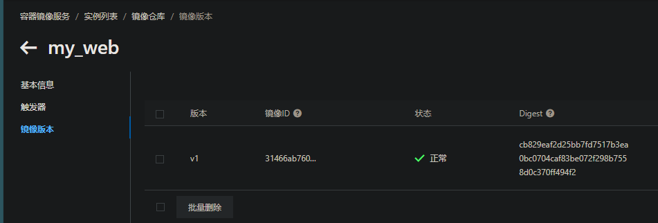
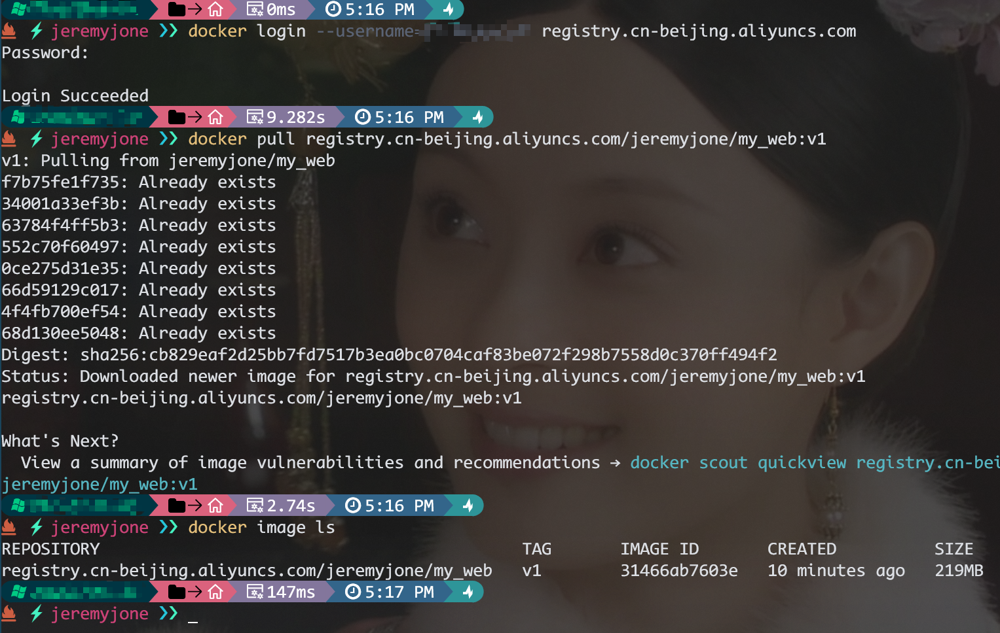

# Docker 私库搭建和使用

在这个实例中，我们将以 **阿里** 的容易镜像服务为基础搭建一个私库，并且让它具有简单的持续集成功能。

## 开通阿里容器服务

登录 [阿里云控制台](https://console.aliyun.com)，搜索 `容易镜像服务`，会看到如下内容：



### 开通个人版实例

如果开通了服务，则会显示上图，直接点击 `个人版` 即可。

如果没有开通，手动点击 `创建个人版实例` 即可。这个就不过多赘述了。

### 创建访问凭证

进入个人实例页面，点击左侧菜单的 `访问凭证`，按照页面提示创建一个固定密码。它的作用是可以让我们更便捷的自动更新私库内容。

后面我们遇到登录的情况，使用我们的 `阿里云帐号` + 刚刚创建的 `固定密码`，就可以正常登录了。

### 创建一个命名空间

点击左侧菜单的 `命名空间`，然后创建一个喜欢的空间名字即可。

- 自动创建仓库，可以在 push 时自动添加仓库，如果关闭，必须手动创建
- 仓库类型，默认私有。如果公开，则意味着所有人都可以匿名下载

添加之后，我们就可以看到：



### 绑定代码仓库

为了让我们可以持续集成，可以选择绑定我们平常的代码源。

点击左侧菜单的 `代码源`，选择一个平时使用的平台，阿里提供了 `Codeup`、`Github`、`Bitbucket`、`GitLab`，其他目前没有。

> 我试了一下，好像是只能绑定一个账号。所以，当我们在一个平台有多个号时，可能需要一些其他操作了就。比如把一个账号设为所有项目的管理员

::: tip

如果不需要代码的持续集成，仅仅是需要每次 `docker build` 然后 `docker push` 的小伙伴，可以忽略这个代码源的绑定。

:::

这样，我们的容器镜像服务就算是配置完成了。下面就可以开始使用它了。

## 创建一个私库

首先，我们可以手动创建一个仓库。

> 如果我们配置命名空间开启了 `自动创建仓库` 的话，那么我们可以不用手动创建，这就是开启它的好处。
> 
> 但是，手动创建也有手动创建的强大功能，我们来实现它

### 手动创建仓库

点击左侧菜单的 `镜像仓库`，然后创建镜像仓库：



这里我们随便填写，写你需要创建的仓库的名称。然后点下一步，可以绑定平台账号，也可以直接使用本地仓库（直接 push）：



这里需要注意，如果我们使用的是海外平台，一定选择 `海外机器构建`，这样可以加速构建和推送。同时，尽量取消 `代码变更自动构建` 功能。毕竟不是每次提交都是发版，对吧。

创建好之后，就可以看见一个新的仓库在列表里啦~



### 私库初体验

此时，我们已经可以尝试 push 一下了。如果本地有镜像，就可以直接推送看看。那么地址是多少呢？

我们点击仓库名称，进入仓库详情页面，看到上面的公网地址，它就是我们需要的地址：



在我们本地电脑上（需要确认已经安装了 docker），我们可以直接登录，然后推送一个试试：

```bash
# 首先登录 -- 用户名和仓库地址改成自己的
docker login --username=xxx registry.cn-beijing.aliyuncs.com
# 回车输入密码

# 登录成功后，就可以 push 了
# 需要注意镜像需要带着地址前缀
docker tag [imageId] registry.cn-beijing.aliyuncs.com/jeremyjone/my_web:[版本号]
docker push registry.cn-beijing.aliyuncs.com/jeremyjone/my_web:[版本号]
```



可以看到已经可以正确的推送镜像了。推送完成后，点击页面左侧 `镜像版本` 可以看到一个 v1 的版本镜像内容在列表中。



此时，我们已经实现了一个私库，并且已经成功推送了一个镜像版本。接下来我们就可以使用它了。

## 使用私库

就像我们使用正常的 docker.io 官方镜像一样，我们可以直接 使用 `docker pull` 命令，拉取镜像部署到指定电脑上。

由于我们的私库设置了私有属性，所以相比官方库来说，我们需要多一步登录操作。而如果我们的仓库设置了公开，那么则所有人都可以直接拉取镜像。

```bash
# 首先登录 -- 用户名和仓库地址改成自己的
docker login --username=xxx registry.cn-beijing.aliyuncs.com
# 回车输入密码

# 登陆成功后，就可以 pull 了
docker pull registry.cn-beijing.aliyuncs.com/jeremyjone/my_web:[版本号]
```



## 持续集成-让服务保持自动更新

上面所做的其实已经基本完成了一个私库的大部分功能。 我们希望的是可以让它更加便捷，这里通过 Github Action 来实现自动化。

其实逻辑是一样的，就是在特定的情况下，让其可以自动触发。因为 Github Action 默认支持 docker，我们完全可以直接使用其命令：

```yaml
name: Deploy
on:
  push:
    branches:
      - main

jobs:
  build:
    runs-on: ubuntu-latest
    steps:
      - name: Checkout
        uses: actions/checkout@master
        
        # 这里可能需要其他操作
      - name: xxx
        run: xxx

      - name:
        id: version
        run: echo "::set-output name=version::$(date +%Y%m%d%H%M%S)"

      - name: Build Docker image
        run: docker build -t ${{ secrets.DOCKER_REGISTRY }}/${{ secrets.DOCKER_NAMESPACE }}:${{ steps.version.outputs.version }} -f ./Dockerfile .

      - name: Login Docker
        run: docker login --username=${{ secrets.DOCKER_USERNAME }} --password=${{ secrets.DOCKER_PASSWORD }} ${{ secrets.DOCKER_REGISTRY }}

      - name: Push Docker Image
        run: docker push ${{ secrets.DOCKER_REGISTRY }}/${{ secrets.DOCKER_NAMESPACE }}:${{ steps.version.outputs.version }}
```

我们省略了其他内容，只看相关命令，这里我们构建了镜像，然后登录，接着 push，这和我们手动 push 其实是一样的。只不过这里所有字段换成了密钥形式，避免泄漏。

> 具体密钥的保存，可以在 Github 仓库的 Settings 中，依次找到：`Secrets and variables`、`Actions`，然后点击 `New repository secret` 即可。

### 保持服务器 docker 的最新环境

此外，我们还可以利用 `appleboy/ssh-action` 来管理服务器上的 docker 镜像：

```yaml
- name: Deploy server
  uses: appleboy/ssh-action@master
  with:
    host: ${{ secrets.REMOTE_HOST }}
    username: ${{ secrets.REMOTE_USER }}
    password: ${{ secrets.REMOTE_PWD }}
    port: 22
    script: |
      docker login --username=${{ secrets.DOCKER_USERNAME }} --password=${{ secrets.DOCKER_PASSWORD }} ${{ secrets.DOCKER_REGISTRY }}
      docker pull ${{ secrets.DOCKER_REGISTRY }}/${{ secrets.DOCKER_NAMESPACE }}:${{ steps.version.outputs.version }}
      docker stop app_name || true
      docker rm app_name || true
      docker run -d --name app_name --restart always ${{ secrets.DOCKER_REGISTRY }}/${{ secrets.DOCKER_NAMESPACE }}:${{ steps.version.outputs.version }}
```

同理，这就是一个简单的远程 ssh 操作管理，需要对应的账号密码即可。

致此，我们已经可以手动搭建 docker 私库，能够推送拉取，并且具有一定自动化功能，同时还可以让我们的服务器具有自动更新的效果。
